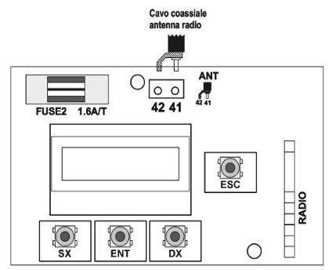

Per collegare l’antenna, seguire il seguente schema.

Utilizzare un cavo coassiale (RG58 o simile) di impedenza 50 Ohm, con lunghezza massima di 5 mt.

Per brevi distanze è sufficiente collegare uno spezzone di filo rigido (17 cm per 433.92 MHz, 8.6 cm per 868 MHz).

