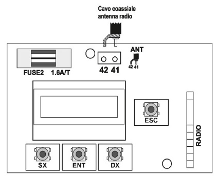

To connect the antenna, follow the schematic below.

Use a 50 Ohm coaxial cable (RG58 or similar) with a maximum length of 5 meters.

For short distances, it is sufficient to connect a piece of rigid wire (17 cm for 433.92 MHz, 8.6 cm for 868 MHz).

