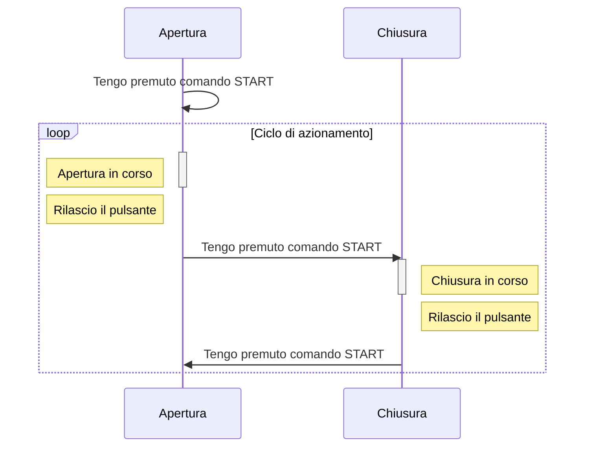

La procedura di installazione viene mostrata all’avvio della centrale solo nel caso in cui non sia già stata installata.  

## **Avviare la centrale**

Alimenta la centrale

*NOTA: Assicurati di aver effettuato correttamente tutti i collegamenti prima di inizializzare la centrale*

## **Selezionare la lingua**

| | |
| - | - |
| `LINGUA` | Premere il tasto **DX** o **SX** per scegliere la lingua desiderata, quindi premere **ENT** per confermare.

## **Verifica motori**

Verificare ora il corretto collegamento dei motori 
Sul display comparirà il seguente comando. Eseguire la procedura descritta.

| | |
| - | - |
| `DIREZ. APRI INSTALLARE` | Tenendo premuto il pulsante **PP** (Passo-Passo) o il pulsante del radiocomando associato, l'anta M1 (battente) dovrà muoversi eseguendo un apertura.  In base allo sfasamento impostato dovrà successivamente muoversi l'anta M2 (battuta).  Al rilascio del pulsante **PP** o del telecomando, la direzione delle ante sarà opposta alla precedente. |

 

*NOTA: Qualora la direzione di un anta non fosse corretta (prima apertura e poi chisura è la direzione corretta), invertire le fasi del motore associate a quell'anta.*

 

Di seguito è riportato il corretto ciclo di funzionamento

Once proper operation has been verified, **return the gates to the halfway point**

<b>Are the motors not moving?</b>

    **Set the force values**

It may be necessary to increase the force values.

In this case, press the `ENT` button and set the following parameters.

| | |
| - | - |
| `ADVANCED MENU -> FORCE M1` | Set the force value for motor M1 |
| `ADVANCED MENU -> FORCE M2` | Set the force value for motor M2 |

Then turn off and turn on the control unit again to re-enter the programming mode.

## **Press the `ENT` key**

The control unit now requires confirmation to start the self-learning process.

Press the **`ENT`** key to start. 
Press the **`ESC`** key to cancel. 

**At this point, the control unit initiates an opening maneuver followed by a closing maneuver. 
This way it learns the working times of the gate.**

 

*WARNING!: During this phase, the obstacle detection is disabled. Ensure there are no obstacles within the gate's range of action during the entire procedure.*

**The installation procedure is completed. However, it is possible to manually change the operating logics via the Menus**

## End of Travel Limits

If present in the system, follow the guide below

<b>End of travel limit in opening</b>

If the system provides for end-of-travel limits in opening, set the parameters as follows

| | |
| - | - |
| `System Menu -> EOT1/EOT2` | **PRESENT** |

<b>End of travel limit in closing</b>

If the system provides for end-of-travel limits in closing, set the parameters as follows

| | |
| - | - |
| `System Menu -> EOC1/EOC2` | **PRESENT** |

