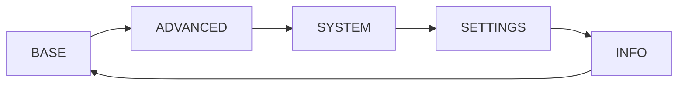

For programming, the control unit is equipped with a display for viewing parameters and 4 buttons to navigate through the various Menus.

### Buttons

| Button | Function |
| ---- | ---- |
| **SX** | Scroll left |
| **ENT** | Enter menus and save parameters |
| **DX** | Scroll right |
| **ESC** | Exit menus and cancel the current operation |

 

#### How to access the main menu

At any time, you can access the main menu by pressing **SX** and **DX** buttons simultaneously 
NB: Access is allowed only if the control unit is not performing any maneuvers.

 

#### How to scroll through the menu

To scroll through the various items, press the **SX** and **DX** buttons. Then press **ENT** to enter the selected menu.

Within each menu item, there is a list of parameters that can be scrolled through with the SX and DX buttons. Once the parameter you want to change has been identified, press the ENT button.

The value of the selected parameter begins to flash, indicating to the user that they have entered the parameter modification mode.  
Now move with the SX and/or DX buttons to change its value, then press ENT to save it.