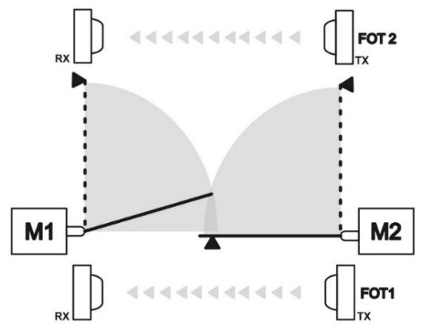
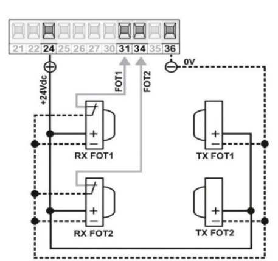

<b>Swing Gate Automations</b>

### Swing Gate Automation

The control unit is designed for the use of two photocells, one to be placed inside and one outside.

The photocells can then be equipped with an input for controlling whether they are operational or not. Depending on the situation, follow one of the following wiring diagrams.

##### Wiring of photocells without control

##### Wiring of photocells with control

<b>Sliding Gate Automations</b>

### Sliding Gate Automation

The control unit requires the use of a photocell (FOT1) and optionally FOT2

The photocells can also be equipped with an input for controlling whether they are functional or not. Depending on the situation, follow one of the following wiring diagrams.

##### Wiring of photocells without control

##### Wiring of photocells with control

