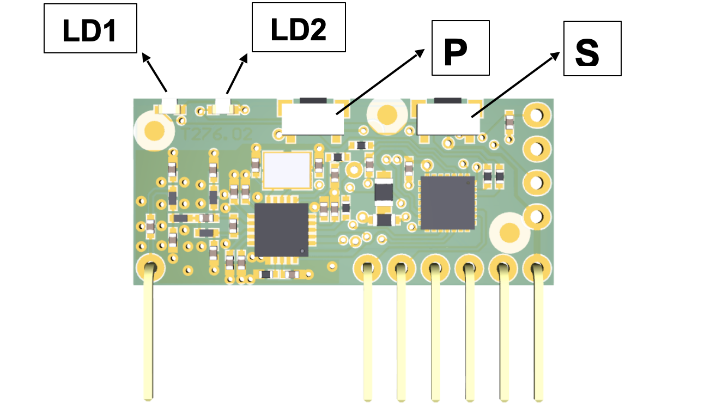

The control board integrates a multi-frequency receiver capable of storing up to 40 fixed or Rolling Code keys.

## **Remote Control Registration**

The registration procedure allows you to associate a button on the remote control with a channel on the receiver.
The receiver has two channels:

**Channel 1**: dedicated to the Step-By-Step (SBS) function 
**Channel 2**: dedicated to controlling the CH2 RADIO output

To proceed with registration, press the P button.

The LED related to channel 1 will start blinking. To select channel 2, press the P button again.

After selecting the desired channel, press and hold the button on the remote control that you want to register until both LEDs (LD1 and LD2) on the receiver stay lit; it may take a few seconds before the receiver decodes the new code.

Subsequently, the type of remote control stored is displayed according to the table below.

| LD1 | LD2 | Description |
| --- | --- | ----------- |
| **ON** | 1 flash | Remote control stored as Fixed Code |
| **ON** | 2 flashes | Remote control stored as Rolling Code |
| **ON** | 3 flashes | Rolling Code Remote stored as fixed |

If during the remote control registration procedure the LED of the associated relay stays on for one second and then emits a double slow flash, it is necessary to send an additional SEED code via the remote control.

This code is transmitted by some remote controls using a hidden button or a combination of buttons.

If you do not know the procedure or are unable to transmit the SEED code, continue to press the button on the remote control that you are trying to register: it will be stored as a fixed HCS code.

Keep pressed until the storage is complete (LD1 and LD2 remain lit for half a second).

## **Remote Control Deletion**

To delete a remote control, press the P button (the LD1 LED starts blinking), then press the S button.

At this stage both LD1 and LD2 LEDs are lit, press the button on the remote control you want to delete and hold it until all LEDs turn off.

The deletion has been executed; repeat the operation for all the remote control buttons you wish to delete.

## **Total Radio Reset**

To perform a total reset of the radio, press the P and S buttons simultaneously for 10 seconds and hold them until the LEDs flash rapidly, then release the buttons.

## **Error Indication**

| LD1 | LD2 | Description |
| --- | --- | ----------- |
| **BLINKING** | **ON** | Code not found |
| **ON** | **BLINKING** | Code memory full |
| **OFF** | **BLINKING** | Frequency memory full |
