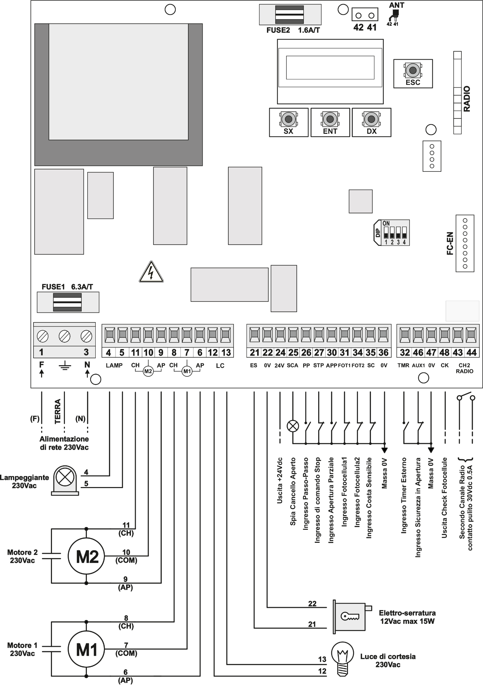

 

| Terminal | Acronym | Description |
| --- | --- | --- |
| 1, 3 | **F - N** | Power supply 230 V AC ± 10% (50-60Hz) |
| - | **GND** | Ground connection |
| 4, 5 | **LAMP** | Flashing light output 230 V AC |
| 11 | **CH** | Closing output for gate motor M2 (fixed leaf) |
| 10 | **COM** | Common output for gate motor M2 (fixed leaf) |
| 9 | **AP** | Opening output for gate motor M2 (fixed leaf) |
| 8 | **CH** | Closing output for gate motor M1 (swing leaf) |
| 7 | **COM** | Common output for gate motor M1 (swing leaf) |
| 6 | **AP** | Opening output for gate motor M1 (swing leaf) |
| 12, 13 | **LC** | Courtesy light output 230 V AC |
| 21 | **ES** | Electric lock output 12 V AC |
| 22 | **0 V** | Reference potential output 0 V |
| 24 | **24 V** | Power supply output + 24 V DC |
| 25 | **SCA** | Open gate indicator output 24 V |
| 26 | **PP** | Step-by-step control input (NO) |
| 27 | **STP** | Stop control input (NC) |
| 30 | **APP** | Partial opening control input |
| 31 | **FOT1** | External photocell input 1 (NC) |
| 34 | **FOT2** | Internal photocell input 2 (NC) |
| 35 | **SC** | Sensitive edge (NC or 8k2) |
| 36 | **0 V** | Reference potential output (0 V) |
| 32 | **TMR** | External timer input (NO) |
| 46 | **AUX1** | Safety input during opening (NC) |
| 47 | **0 V** | Reference potential output 0 V |
| 48 | **CK** | Power supply output for photocell check (+ 24 V DC) |
| 43, 44 | **CH2** | Second channel radio output |
| 42, 41 | **ANT** | Antenna connection |
|  | **FC-EN** | End-of-travel module connector |
|  | **RADIO** | Radio Module |

 
