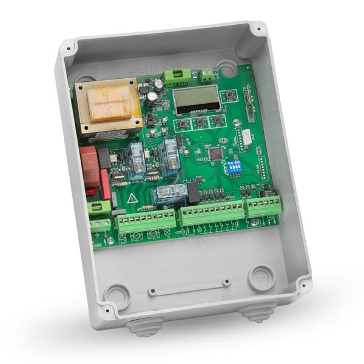

# Introduzione

In questa guida vengono presentate tutte le funzionalità della centrale universale per motori a 230 V. Questa centrale è adatta a comandare

- Cancelli scorrevoli a 1 anta
- Cancelli a battente a 1 o 2 ante

Monta inoltre una ricevente multifrequenza che permette una grande compatibilità con la maggior parte dei trasmettitori sul mercato.

 

## Avvertenze importanti

Domotime Srl si riserva il diritto di apportare modifiche tecniche al prodotto senza preavviso; declina inoltre ogni responsabilità per danni a persone o cose dovuti a uso improprio o installazione errata della centralina DUCB230V.

Questo manuale di istruzioni è destinato esclusivamente a personale tecnico qualificato nel campo delle installazioni di automazione.

Nessuna delle informazioni contenute in questo manuale è destinata all'utente finale.

Per chiarimenti tecnici o problemi di installazione, Domotime Srl dispone di un servizio di assistenza clienti, che
risponde al numero di telefono 030 9913901.