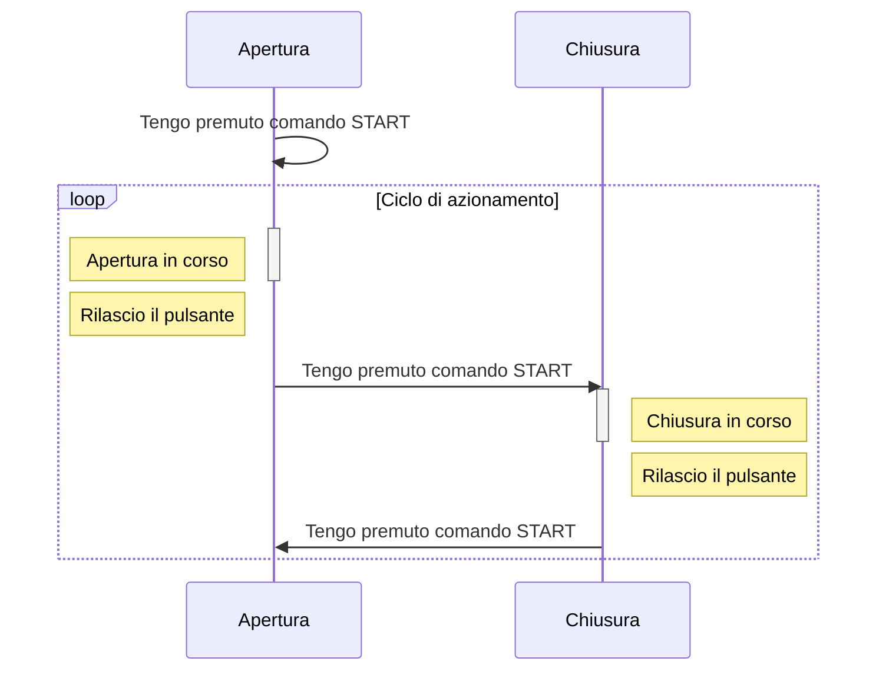

La procedura di installazione viene mostrata all’avvio della centrale solo nel caso in cui non sia già stata installata.  

## **Avviare la centrale**

Alimenta la centrale

*NOTA: Assicurati di aver effettuato correttamente tutti i collegamenti prima di inizializzare la centrale*

## **Selezionare la lingua**

| | |
| - | - |
| `LINGUA` | Premere il tasto **DX** o **SX** per scegliere la lingua desiderata, quindi premere **ENT** per confermare.

## **Verifica motori**

Verificare ora il corretto collegamento dei motori 
Sul display comparirà il seguente comando. Eseguire la procedura descritta.

| | |
| - | - |
| `DIREZ. APRI INSTALLARE` | Tenendo premuto il pulsante **PP** (Passo-Passo) o il pulsante del radiocomando associato, l'anta M1 (battente) dovrà muoversi eseguendo un apertura.  In base allo sfasamento impostato dovrà successivamente muoversi l'anta M2 (battuta).  Al rilascio del pulsante **PP** o del telecomando, la direzione delle ante sarà opposta alla precedente. |

 

*NOTA: Qualora la direzione di un anta non fosse corretta (prima apertura e poi chisura è la direzione corretta), invertire le fasi del motore associate a quell'anta.*

 

Di seguito è riportato il corretto ciclo di funzionamento

Una volta verificato il corretto funzionamento, **riportare le ante a metà corsa**

<b>I motori non si muovono?</b>

    **Impostare i valori di forza**

Potrebbe essere necessario aumentare i valori di forza.

In questo caso premere il tasto `ENT` e impostare i seguenti parametri.

| | |
| - | - |
| `MENU AVANZATO -> FORZA M1` | Impostare il valore di forza del motore M1 |
| `MENU AVANZATO -> FORZA M2` | Impostare il valore di forza del motore M2 |

Poi spegnere e riaccendere la centrale per rientrare nella modalità di programmazione.

## **Premere il tasto `ENT`**

La centrale ora richiede conferma per avviare il processo di apprendimento automatico.

Premere il tasto **`ENT`** per avviare. 
Premere il tasto **`ESC`** per annullare 

**A questo punto la centrale imposta i tempi di lavoro a 60 s.**

## **Impostazione manuale dei parametri**

Impostare `MENU IMPIANTO -> MOTORE ELETTROMEC. = OLEODINAMICO`

Impostare poi i tempi di lavoro tramite  `MENU AVANZATO -> TEMPO LAVORO M1` `MENU AVANZATO -> TEMPO LAVORO M2`

 

*ATTENZIONE!: Furante questa fase il rilevamento ostacolo viene disabilitato. Assicurarsi non ci siano ostacoli nel raggio di azione dele cancello durante l'intera procedura.*

**La procedura di installazione è completata. E' possibile tuttavia modificare manualmente le logiche di funzionamento tramite i Menu**

## Finecorsa

Qualora fossero presenti nell'impianto, seguire la guida sottostante

<b>Finecorsa in apertura</b>

In caso l'impianto preveda dei finecorsa in apertura, impostare i parametri come di seguito

| | |
| - | - |
| `Menu Impianto -> FCA1/FCA2` | **PRESENTE** |

<b>Finecorsa in chisura</b>

In caso l'impianto preveda dei finecorsa in chiusura, impostare i parametri come di seguito

| | |
| - | - |
| `Menu Impianto -> FCC1/FCC2` | **PRESENTE** |

