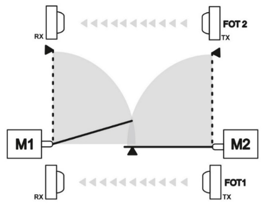
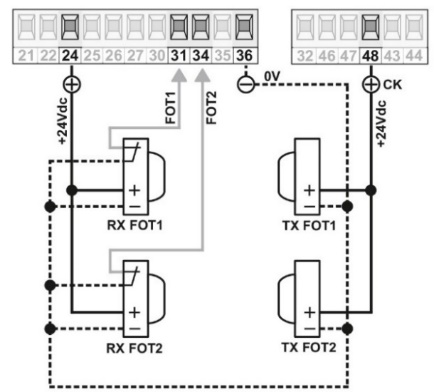
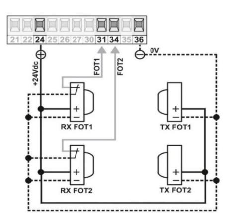

<b>Automazioni a battente</b>

### Automazione a battente

La centrale prevede l'utilizzo di due fotocellule, una da posizionare all'interno e una all'esterno.

Le fotocellule possono poi essere dotate di un ingresso per il controllo deel funzionamento o meno. In base alla situazione, seguire uno dei seguenti schemi di collegamento.

##### Collegamento fotocellule senza controllo

##### Collegamento fotocellule con controllo

<b>Automazioni a scorrevole</b>

### Automazione scorrevole

La centrale prevede l'utilizzo di una fotocellula (FOT1) e opzionalmente FOT2

Le fotocellule possono poi essere dotate di un ingresso per il controllo deel funzionamento o meno. In base alla situazione, seguire uno dei seguenti schemi di collegamento.

##### Collegamento fotocellule senza controllo

##### Collegamento fotocellule con controllo

