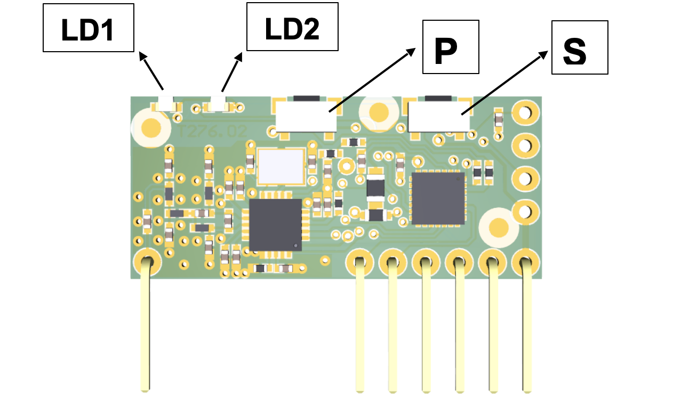

Sulla centrale è integrata una ricevente multifrequenza in grado di memorizzare fino a 40 codici fissi o Rolling Code.

## **Registrazione di un radiocomando**

La procedura di registrazione consente di associare un tasto del radiocomando ad un canale della ricevente.
La ricevente ha due canali: 

**Canale 1**: dedicato alla funzione PP (Passo-Passo) 
**Canale 2**: dedicato al pilotaggio dell’uscita CH2 RADIO

Per procedere alla registrazione premere il tasto P. 

Il led relativo al canale 1 inizia a lampeggiare, per selezionare il canale 2 premere nuovamente il tasto P.

Dopo aver selezionato il canale desiderato, premere il tasto del radiocomando che si vuole registrare e tenerlo premuto affinché i due led (LD1 e LD2) della ricevente rimangono accesi, possono trascorrere alcuni secondi prima che il ricevitore decodifichi il nuovo codice.

Successivamente si visualizzerà il tipo di radiocomando memorizzato secondo la tabella riportata di seguito.

| LD1 | LD2 | Descrizione |
| - | - | - |
| **ACCESO** | 1 lampeggio | Radiocomando memorizzato come Codice Fisso |
| **ACCESO** | 2 lampeggi | Radiocomando memorizzato come Rolling Codee |
| **ACCESO** | 3 lampeggi | Radiocomando Rollingo Code memorizzato come fisso |

Nel caso in cui durante la procedura di registrazione di un radiocomando il led del relè associato resta acceso per un secondo e successivamente emette un doppio lampeggio lento, è necessario inviare un ulteriore codice SEED tramite il radiocomando. 

Questo codice è trasmesso da alcuni radiocomandi tramite un tasto nascosto o una combinazione di tasti. 

Nel caso non si conosca la procedura o non si ha la possibilità di trasmettere il codice SEED, continuare a premere il tasto del radiocomando che si sta cercando di registrare: questo verrà memorizzato come un HCS a codice fisso.

Mantenere premuto fino a che la memorizzazione non è stata completata (LD1 e LD2 restano accesi per mezzo secondo).

## **Cancellazione di un radiocomando**

Per cancellare un radiocomando premere il tasto P (il led LD1 inizia a lampeggiare), quindi premere il tasto S.

In questa fase i led LD1 e LD2 sono entrambi accesi, premere il tasto del radiocomando che si vuol cancellare e mantenerlo premuto fino allo spegnimento di tutti i led. 

La cancellazione è stata eseguita, ripetere l’operazione per tutti i tasti dei radiocomandi che si desiderano cancellare.

## **Reset totale radio**

Per eseguire il reset totale della radio premere simultaneamente i tasti P ed S per 10 secondi e mantenerli premuti sino al lampeggio veloce dei led, quindi rilasciare i tasti.

## **Segnalazione errori**

| LD1 | LD2 | Descrizione |
| - | - | - |
| **LAMPEGGIO** | **ACCESO** | Codice non trovato |
| **ACCESO** | **LAMPEGGIO** | Memoria codici piena |
| **SPENTO** | **LAMPEGGIO** | Memoria frequenze piena |